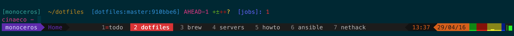

# dotfiles

Configuration files for:

- Bash (3.2+) and Zsh (4.3.17+)
- Vim (7+) and NeoVim
- Vimperator (3.8+) and Tridactyl
- Tmux (1.8+)
- Other bits and pieces

Heavy preference for Vim-like bindings.

## Installation

Clone to a home folder and run `make install` or `./install`.

Restart the terminal session.

## Usage

Below is a non-exhaustive list of dotfiles usage.

### Bash/Zsh

- Case-insensitive completion.
- The excellent [z][] and [v][] commands:
  - `z` for folder jumping: `z regex` = `cd /path/with/regex`.
  - `v` for file editing: `v regex` = `vim /path/with/regex`.
- Multi-line shell prompt that displays Git repo info and job count.
- Mostly-Mnemonic Git shortcuts: `gs` = `git status`, `gd` = `git diff`, etc.
- SSH agent automated - attempts to load identities with `ssh-add` on start.
- Custom settings can be contained in `.local` files:
  - bash: `~/.bashrc.local` and `~/.bashenv.local`
  - zsh: `~/.zshrc.local` and `~/.zshenv.local`

[z]: https://github.com/rupa/z
[v]: https://github.com/rupa/v

### Vim

`Space` is the `<Leader>`.

- `<Leader>w` saves.
- `<Leader>q` closes.
- `<Leader>l` lists loaded buffers and allows jumping to them by number.
- `<Leader>p` fuzzy-finds files.
- `<Leader>f` fuzzy-finds functions in the current file.
- `<Leader>t` opens a function/variable list for the current file.
- `<Leader>n` toggles line numbers.
- `<Leader>c` finds VCS conflict markers.
- `-` opens a file browser.
- Additional text objects exist (see `'Text Objects'` in [plugins.vim][]).
- Saving `.pandoc` files also outputs `.docx` versions.
- `:Goyo` for distraction-free writing.
- `:Alduin`, `:Dark`, `:Light` and `:Neon` colour schemes available.
- Custom plugins can be listed in `~/.vim/plugins.vim.local`.
- Custom settings can be put in `.vim.local` files in `~/.vim/settings/`, or in
  a `~/.vim/settings/local/` directory.

[plugins.vim]: vim/plugins.vim

### Tmux

`<C-a>` = `Ctrl-a` = the tmux prefix.

- `<C-a> + [vi motion]` moves around panes.
- `<C-a> + <C-[vi motion]>` moves around windows.
- `Alt/Meta + number` moves to window number (1-10).
- `<C-a> + -` cuts a pane horizontally,
- `<C-a> + \` cuts a pane vertically (think `|`).
- `<C-a> + s` starts synchronized panes.
- `<C-a><C-s>` swaps between sessions.
- Mouse support works for selecting and resizing panes/windows.

### Vimperator and Tridactyl

Apart from the default Vimperator goodness e.g.

- `/` searches like `vim`.
- `f` and `F` follow links on this tab/in a new tab.
- et cetera...

These dotfiles provide a dark theme and the following binding changes:

- `h` and `l` - change between tabs (left and right).
- `j` and `k` - scroll by a half-page (down and up).
- `H`, `J`, `K`, `L` - scroll slowly (left, down, up, right).
- `<C-h>` and `<C-l>` - relocate a tab left and right.

## Recommended

- Colour palette: [Solarized][].
- Font: [Meslo for Powerline][] (works well with [Rainbarf][]).
- Vim with Ruby/Python support, or Neovim: for [Vim-Plug][] parallel downloads.
- [Ripgrep][] - fast text search ([Ack][] included as fallback).
- [Pandoc][] - Vim creates documents from `.pandoc` files ([Pandoc Markdown][]).
- [pandoc-citeproc][] - bibliographical assistance when using Pandoc.

[Solarized]: http://ethanschoonover.com/solarized
[Meslo for Powerline]: https://github.com/powerline/fonts
[Rainbarf]: https://github.com/creaktive/rainbarf
[Vim-Plug]: https://github.com/junegunn/vim-plug
[ripgrep]: https://github.com/BurntSushi/ripgrep
[Ack]: http://beyondgrep.com/
[Pandoc]: http://pandoc.org/
[Pandoc Markdown]: http://pandoc.org/README.html#pandocs-markdown
[pandoc-citeproc]: https://github.com/jgm/pandoc-citeproc
